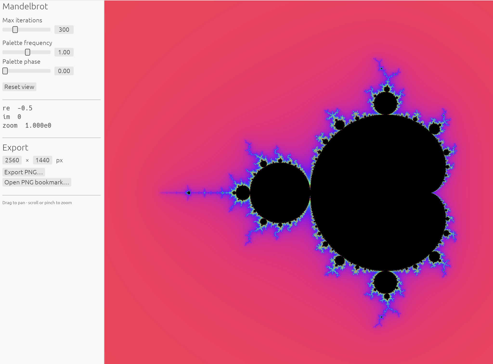
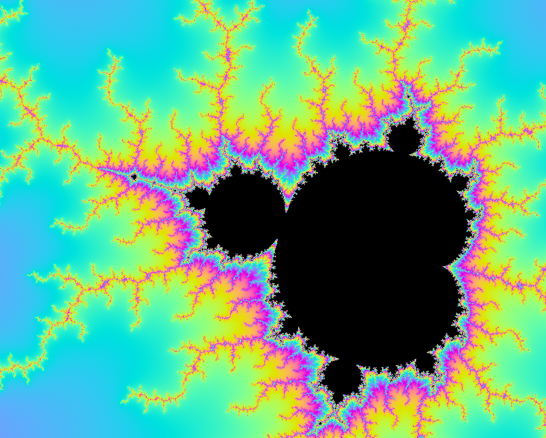

# FractalX

A fast, native, cross-platform fractal explorer for macOS and Windows,
written in Rust with GPU rendering (wgpu: Metal / DirectX 12 / Vulkan) and an
egui interface. Linux is untested but expected to work (wgpu/Vulkan).

Zoom into the Mandelbrot set down to **~10³⁰×** magnification — far beyond
double precision — build iterated function systems (Barnsley fern, Sierpinski
triangle, or your own affine maps), grow L-system curves and plants, and
export any view as a PNG that carries its exact coordinates inside, so every
image can be reopened right where it was taken.



*Self-similarity in action: a minibrot with its own halo of filaments, found by
zooming in.*



## Features

- **GPU-rendered escape-time explorer** — Mandelbrot,
  Multibrot (power 2–8), and Julia sets (pick the constant numerically or
  from classic presets): smooth pan (drag) and zoom (scroll/pinch, anchored
  at the pointer), iteration depth up to 100,000, and exact coordinate entry
  (paste a 40-digit deep-zoom location and jump straight there). While
  exploring the Mandelbrot set, a corner overlay previews the Julia set for
  the point under the cursor, live.
- **Color palettes** — six cosine-gradient presets (Classic, Sunset, Fire,
  Electric, Pastel, Grayscale) with frequency and phase controls, a live
  gradient preview, and a coefficient editor for building custom palettes —
  all shared by every renderer. Palette changes re-colorize instantly; the
  fractal is never re-computed.
- **Deep zoom via perturbation theory** — a single reference orbit is computed
  on the CPU in arbitrary-precision arithmetic; the GPU iterates only each
  pixel's tiny delta in f32, with rebasing. Precision scales automatically
  with zoom depth. Works to ~10³⁰×, where f32 pixel deltas finally underflow.
- **IFS explorer (chaos game)** — a second fractal family: iterated function
  systems rendered as density plots, computed across all CPU cores with
  deterministic output. Ships with Sierpinski triangle, Barnsley
  fern, and Heighway dragon presets; edit the affine-map coefficients
  numerically (or add your own maps) and the attractor re-renders. *Reset
  view* fits the viewport to the attractor. (Visual drag-handle editing is
  planned, not built yet.)
- **L-systems** — a third family: axiom + rewrite rules interpreted as turtle
  graphics. Nine presets — Koch snowflake and island, dragon, Hilbert, Gosper,
  and Lévy C curves, Sierpinski arrowhead, and two plants — plus a full rule
  editor (axiom, per-symbol rules, turn angle, generations); curves are
  colored along their length through the palette.
- **Strange attractors** — Clifford and de Jong maps as glowing density
  plots, computed across all CPU cores with fully deterministic output;
  four presets plus live numeric editing of the map parameters.
- **Progressive rendering** — interaction never stalls: the Mandelbrot view
  renders through a resolution ladder (coarse immediately, sharpening in
  place), and density images (IFS, attractors) "develop" as points accumulate
  each frame.
- **PNG export with embedded bookmarks** — renders offscreen at any resolution
  (up to 16K), independent of the window. The complete view state (center
  coordinates at full precision, zoom, iterations, palette) is embedded in the
  PNG as an `iTXt` metadata chunk. *Open PNG bookmark…* jumps back to exactly
  that view.
- **Reproducible by construction** — a bookmark fully determines a render;
  there is no hidden state.

## Building

Requires a stable Rust toolchain. On Windows, the MSVC toolchain also needs
"Build Tools for Visual Studio" with the *Desktop development with C++*
workload (for `link.exe`).

On Linux (untested — reports welcome), install the windowing build
dependencies first; on Debian/Ubuntu:

```sh
sudo apt install libxkbcommon-dev libwayland-dev \
  libxcb-render0-dev libxcb-shape0-dev libxcb-xfixes0-dev
```

At runtime you'll need working Vulkan drivers; file dialogs use the
`xdg-desktop-portal` service (present on all major desktops).

```sh
cargo run --release
```

Debug builds work but render noticeably slower; use `--release` for exploring.

Run the test suite (includes headless GPU tests, so a machine with a GPU
adapter is needed):

```sh
cargo test
```

## Usage

| Action | Input |
|---|---|
| Switch fractal family | *Family* dropdown (Mandelbrot / Multibrot / Julia / IFS / L-system / Strange attractor) |
| Pan | drag the canvas |
| Zoom | scroll wheel or trackpad pinch (anchored at pointer) |
| Jump to exact coordinates | type into the *re / im / zoom* fields, press Enter |
| Iterations / points | sliders in the left panel |
| Change colors | *Palette* dropdown, frequency/phase sliders, *Edit coefficients* for custom palettes |
| Julia preview (Mandelbrot) | hover the canvas; `J` pins/unpins the point; click the pane to open it as a full Julia view |
| Edit an IFS | preset buttons, then tweak the affine-map coefficients |
| Edit an L-system | preset buttons, then edit axiom/rules/angle/generations |
| Export image | set resolution, *Export PNG…* |
| Reopen an exported view | *Open PNG bookmark…* |
| Back to the full set / fit attractor | *Reset view* |

When you zoom past ~3×10⁴×, the renderer switches to the perturbation path
automatically (shown in the panel). If detail dissolves into flat color at
extreme depth, raise the iteration slider — deep locations often need tens of
thousands of iterations.

## How deep zoom works

Standard f32 GPU math runs out of bits at about 10⁴–10⁵× zoom, and GPU
shaders (WGSL) have no f64. FractalX uses the modern deep-zoom technique
instead:

1. The view center is tracked in arbitrary-precision floats
   ([dashu](https://crates.io/crates/dashu)), with precision growing with zoom
   (pixel scale + 64 guard bits).
2. One **reference orbit** is iterated at that precision on the CPU.
3. Each pixel iterates only its **delta** from the reference in f32 on the
   GPU (`δ′ = δ(2Z + δ) + δc`), rebasing to the orbit start whenever the delta
   outgrows the reference — which also handles the classic glitch cases.

The reference orbit is cached and only recomputed when the view drifts away
from it, so panning stays smooth even at extreme depth.

## Project status & roadmap

Early but functional prototype — part of a larger concept for exploring
self-similarity (escape-time fractals, IFS/L-systems, and statistical
fractals); see [CONCEPT.md](CONCEPT.md) for the full vision and current
implementation status.

Planned next: visual drag-handle editing of IFS maps, a bookmarks journal
with thumbnails, custom formula expressions.

## Tech

Rust · [wgpu](https://wgpu.rs) (Metal / DirectX 12 / Vulkan) ·
[egui/eframe](https://github.com/emilk/egui) ·
[dashu](https://crates.io/crates/dashu) arbitrary precision ·
[rayon](https://crates.io/crates/rayon) parallelism · WGSL shaders

## License

[MIT](LICENSE)
